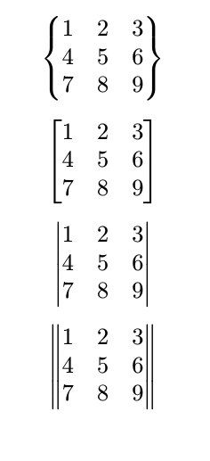

#### LaTex文档的基本结构、编译和调试、命令符号的输入（如%，{..}等等）

1. 用于选择调用那个模板，比如article（用于文章），book（用于书籍），report（用于学术报告），letter（用于信件）:

```latex
\documentclass{article}
```

2. 宏包（类似于C语言中的头文件包含）：

```latex
\usepackage{amsmath} %宏包，美国数学协会
```

3. 正文部分 ：

```latex
\begin{document}
% 正文部分
\end{document}
```

4. 文档中的换行通过空行来实现
5. LaTex中的%号表示注释，若确实需要输出%，则需要在%号前加\进行转移即可。
6. 行间公式需要用两个\$符号，行内公式只需要一个\$符号即可
7. 其中要输出\的是时候，需要输入如下的命令

```latex
$\backslash$
```

#### 文档的层次结构（以book为例）

1. 标题：

```latex
\title{this is my book}
```

2. 书的作者：

```latex
\author{wanghaiyun}
```

3. 在设置完标题和作者之后，还需要执行一行代码才可以显示标题和作者：

```latex
\maketitle
```

4. 其中如果不希望显示日期，可以加上如下的代码：

```latex
\date{}
```

5. 对于书来说，其的层次比较多，part表示部分，chapter表示章节，section表示节，subsection表示节下面的节（注意在{}里面写的内容应该为英文的），其中会自带页眉的信息，可以先不用理会，需要用到后面的宏包：

```latex
\part{第一部分}
\chapter{第一章}
\section{第一节}
\subsection{I like latex}
\section{第二节}

\part{diyibufen}
\chapter{diyizhang}
\section{diyijie}
\subsection{I like latex}
\section{dierjie}
```

6. 添加目录：

```latex
\tableofcontents
```

7. 其中，发现页码并不是从正文部分开始，这个时候只需添加一行代码：

```latex
\mainmatter
```

#### LaTex的列表与表格环境，如何快速导出Excel表格至Latex源文件，enumerate宏包使用（setcounter），tabular，table等

1. 无序列表（其中列表支持嵌套，类似与markdown中的无序列表）：

```latex
\begin{itemize}
	\item this is item1
	\begin{itemize}
		\item this is item1
		\begin{itemize}
			\item this is item1
			\begin{itemize}
				\item this is item1
				\item this is item2
				\item this is item3
			\end{itemize}
			\item this is item2
			\item this is item3
		\end{itemize}
		\item this is item2
		\item this is item3
	\end{itemize}
	\item this is item2
	\item this is item3
\end{itemize}
```

2. 有序列表（其中列表支持嵌套，类似与markdown中的有序列表）：

```latex
\begin{enumerate}
	\item this is item1
	\begin{enumerate}
		\item this is item1
		\begin{enumerate}
			\item this is item1
			\item this is item2
			\item this is item3 
		\end{enumerate}
		\item this is item2
		\item this is item3 
	\end{enumerate}
	\item this is item2
	\item this is item3 
\end{enumerate}
```

3. 如果需要修改有序列表前面的数字，并加粗，改变字体，需要先导入宏包`enumerate`，然后执行以下的代码：

```latex
\begin{enumerate}[\bfseries A.]
	\item this is item1
	\begin{enumerate}[\sffamily a.]
		\item this is item1
		\begin{enumerate}[i.]
			\item this is item1
			\item this is item2
			\item this is item3 
		\end{enumerate}
		\item this is item2
		\item this is item3 
	\end{enumerate}
	\item this is item2
	\item this is item3 
\end{enumerate}
```

4. 如果希望有序列表的第一个字母不是从A开始，而是从C开始，可以执行下面的代码：

```latex
\setcounter{enumi}{4}
```

5. 表格的定义：（其中的{clr}分别表示中间对齐，左对齐，右对齐，\\\是为了区分表格的两行数据，$是为了对单元格内的内容进行区分）

```latex
\begin{tabular}{clr}
223&112&333\\
23&12&33\\
\end{tabular}
```

6. 为表格添加边框：（{|c|l|r|}中的|表示表格的竖线，\hline表示为表格添加横线）

```latex
\begin{tabular}{|c|l|r|}
\hline
223&112&333\\
\hline
23&12&33\\
\hline
\end{tabular}
```

7. 从Excel文件中导入数据到latex中：（只需要拷贝Excel文件中的内容，然后改成相应的格式即可）
8. 制作三线表

```latex
\begin{tabular}{ccc}
\hline
223&112&333\\
\hline
23&12&33\\
23&12&33\\
23&12&33\\
23&12&33\\
\hline
\end{tabular}
```

9. 使用带表名的表格：（其中使用的是table环境，\\centering表示元素居中对齐，\caption{this is my table}表示设置表格的表名）

```latex
\begin{table}
	\centering
	\caption{this is my table}
	\begin{tabular}{ccc}
		\hline
		223&112&333\\
		\hline
		23&12&33\\
		23&12&33\\
		23&12&33\\
		23&12&33\\
		\hline
	\end{tabular}
\end{table}
```

10. 单元格合并：（第一个参数表示合并的单元格的数量，第二个参数表示合并后的单元格的对齐方式，第三个参数表示合并后的单元格里面的内容）

  ```latex
  \multicolumn{2}{c}{222}&333\\
  ```

11. 为单元格内地内容添加下划线：（表示在\cline{2-3}上面一行的单元格的第二个和第三个的下面加下划线）

```latex
23&12&33\\
\cline{2-3}
```

12. 长表格可以引入新的宏包：longtable，用法跟table类似

#### 数学公式编辑初步1：行间公式、行内公式、特殊符号的输入、数学字体、从mathtype粘贴代码、公式的编号

1. 行间公式的引导方式：

```
\[a=c\]和$$a=c$$
```

2. 行内公式的引导方式：

```
$a=b+c$
```

3. 直接从mathtype粘贴代码：（首先需要安装mathtype数学公式编辑器软件）
4. 为公式编号：

```latex
\begin{equation}
\frac{{ - b \pm \sqrt {{b^2} - 4ac} }}{{2a}}
\end{equation}
```

4. 让公式按照节的顺序来编号：

```latex
\numberwithin{equation}{section}
```

5. 在不改变公式编号的前提下给公式添加东西：

```latex
\begin{subequations}
	\begin{equation}
	\frac{{ - b \pm \sqrt {{b^2} - 4ac} }}{{2a}}
	\end{equation}
	\begin{equation}
	\frac{{ - b \pm \sqrt {{b^2} - 4ac} }}{{2a}}
	\end{equation}
\end{subequations}
```

6. 为公式添加一个外壳：

```latex
\boxed{
		\frac{{ - b \pm \sqrt {{b^2} - 4ac} }}{{2a}}
	}
```

6. 宏替换：（相当于C语言下的宏定义，原来的函数还是可以使用的）

```latex
\newcommand{\fc}{\frac} 相当于为\frac取了一个别名为\fc，\[\fc{1}{2}\]就等同于\[\frac{1}{2}\]
```

7. 对于算子来说，可以使用如下的命令：

```latex
\[\mathtop{{\rm abcd}}^a_b\]（有问题）
```

#### 数学公式编辑初步2：\left，\right，矩阵的输入，分块矩阵

1. \\left和\\right用于修饰括号的：

   ```latex
   \[\mathop {\lim }\limits_{x \to \infty } {\left( {{\rm{1 + }}\frac{{\rm{1}}}{{\rm{n}}}} \right)^{\rm{n}}} = e\]
   ```

2. 矩阵的输入：（构造一个3*3的矩阵）

```latex
$$\begin{array}{clr}
1&2&3\\
4&5&6\\
7&8&9\\
\end{array}$$
```

3. 为矩阵增加小括号或者中括号：（还是使用\left和\right来实现，不建议手动输入公式，而是使用第三方的软件来输入比较方便，如mathtype）
4. 矩阵的其他输入方式：

```latex
$$\begin{Bmatrix}
1&2&3\\
4&5&6\\
7&8&9\\
\end{Bmatrix}$$

$$\begin{bmatrix}
1&2&3\\
4&5&6\\
7&8&9\\
\end{bmatrix}$$

$$\begin{vmatrix}
1&2&3\\
4&5&6\\
7&8&9\\
\end{vmatrix}$$

$$\begin{Vmatrix}
1&2&3\\
4&5&6\\
7&8&9\\
\end{Vmatrix}$$
```

其对应的显示效果如下：



5. 分块矩阵的操作：（实线，操作方法同表格的边框添加类似）

```latex
$$\left[\begin{array}{c|lr}
1&2&3\\
\hline
4&5&6\\
7&8&9\\
\end{array}\right]$$
```

6. 生成带虚线的分块矩阵（使用宏包arydshln）推荐使用

```latex
{c|l;{4pt/2pt}r}其中的pt表示的是矩阵中的度量单位，这里表示竖线部分的实线的长度是虚线长度的2倍
\hdashline[2pt/4pt] 表示横线的画法
```

#### 数学公式编辑初步1：公式的对齐方式

1. 公式的对齐方式

```latex
\begin{equation}
\begin{split}
z &= {\left( {a + b} \right)^4} = {\left( {a + b} \right)^2}{\left( {a + b} \right)^2}\\
  &= \left( {{a^{^2}} + 2ab + {b^2}} \right)\left( {{a^{^2}} + 2ab + {b^2}} \right)\\
   &= {a^4} + 4{a^3}b + 6{a^2}{b^2} + 4a{b^{^3}} + {b^4}\\
\end{split}
\end{equation}
其中，&=表示以等号对齐，\\表示回车，但是该公式只有一个编号
```

2. 公式对齐的另外一种方法：

```latex
\begin{align}
	z &= {\left( {a + b} \right)^4} = {\left( {a + b} \right)^2}{\left( {a + b} \right)^2}\\
	&= \left( {{a^{^2}} + 2ab + {b^2}} \right)\left( {{a^{^2}} + 2ab + {b^2}} \right)\\
	&= {a^4} + 4{a^3}b + 6{a^2}{b^2} + 4a{b^{^3}} + {b^4}\\
\end{align}
其中，该种方法不需要依赖\begin{equation}，可以独立存在，并且可以有多个编号，并且如果不需要 其前面的编号的时候，可以去掉该编号，如下所示：
\begin{align}
z &= {\left( {a + b} \right)^4} = {\left( {a + b} \right)^2}{\left( {a + b} \right)^2}\nonumber\\
&= \left( {{a^{^2}} + 2ab + {b^2}} \right)\left( {{a^{^2}} + 2ab + {b^2}} \right)\\
&= {a^4} + 4{a^3}b + 6{a^2}{b^2} + 4a{b^{^3}} + {b^4}
\end{align}
```

3. 把几个公式并列到一行

```latex
\begin{equation}
\begin{gathered}
z = {\left( {a + b} \right)^4}\\ 
z = {\left( {a + b} \right)^2}{\left( {a + b} \right)^2}\\
z = \left( {{a^{^2}} + 2ab + {b^2}} \right)\left( {{a^{^2}} + 2ab + {b^2}} \right)\\
z = {a^4} + 4{a^3}b + 6{a^2}{b^2} + 4a{b^{^3}} + {b^4}
\end{gathered}
\end{equation}
其中，它们共用一个公式编号
\begin{eqnarray}
z &=& {\left( {a + b} \right)^4} = {\left( {a + b} \right)^2}{\left( {a + b} \right)^2}\nonumber\\
&=& \left( {{a^{^2}} + 2ab + {b^2}} \right)\left( {{a^{^2}} + 2ab + {b^2}} \right)\\
&=& {a^4} + 4{a^3}b + 6{a^2}{b^2} + 4a{b^{^3}} + {b^4}
\end{eqnarray}
其中的这个使得=号的左右距离变大的一些
```

4. 分段函数：

```latex
Function:

$$I_A(a)=\begin{cases}
	1&a\in A\\
	0&a\not\in A
\end{cases}$$
```

#### 图片的插入、缩放、旋转等

1. 在使用图片插入的时候，需要引出宏包graphics，然后才可以插入图片：

```latex
\includegraphics{pic1.jpg} 其中的参数为图片的地址
```

2. 通过\figure的方式来插入图片

```latex
\begin{figure}
\centering
	\includegraphics[scale=2,angle=30]{pic1.jpg}
	\caption{this is a tu}
\end{figure}
其中，\centering表示图片居中，scale=2,angle=30表示将图片放大2倍并顺时针旋转30°，\caption{this is a tu}表示图片的名字
```

3. eps图片的生成方式，如matlab等

#### LaTex基础：

- 源文件结构

```latex
\documentclass{article} %使用article文档类型格式排版
\usepackage{amsmath} %调用公式宏包
\usepackage{graphicx} %调用插图宏包
... %调用其它宏包和设置命令
\begin{document}
论文内容
\end{document}
```

- 中长篇论文（10-100页）

```latex
\documentclass{book} %使用article文档类型格式排版
\usepackage{amsmath} %调用公式宏包
\usepackage{graphicx} %调用插图宏包
... %调用其它宏包和设置命令 
\begin{document}
\include{cover} %调入封面子源文件cover.tex
\pagenumbering{Roman} %罗马数字页码
\include{abstract} %调入摘要子源文件abstract.tex
\pagenumbering{arabic} %阿拉伯数字页码
\include{contents} %调入创建目录子源文件contents.tex
\pagenumbering{arabic} %阿拉伯数字页码
\include{chapter1} %调入第一章子源文件chapter1.tex
\include{chapter1} %调入第二章子源文件chapter1.tex
...
\include{reference} %调入参考文献子源文件reference.tex
\end{document}
```

- 文件名
- 命令
- 文档类型

常用文档的用途和特点

|  文类名   | 用途         | 特点                      |
| :----: | ---------- | ----------------------- |
| aticle | 短文、评论、学术论文 | 无左右页区分处理，无章设置           |
|  book  | 专业著作、学位论文  | 默认有左右页区分处理，章起右页         |
| report | 商业、科技和试验报告 | 默认无左右页区分处理，章起新页         |
| beamer | 论文陈述幻灯片    | 提供多种主题样式，可方便地更改幻灯片的整体风格 |

- 宏包
- 模式

  - 左右模式
  - 段落模式
  - 数学模式
- 符号
  - 专用符号
  - 文本符号
  - 数学符号
- 长度设置
  - 长度单位
  - 长度命令
- 盒子
- 计数器
  - 计数器
  - 计数器和命令设置
- 交叉引用
- 环境
